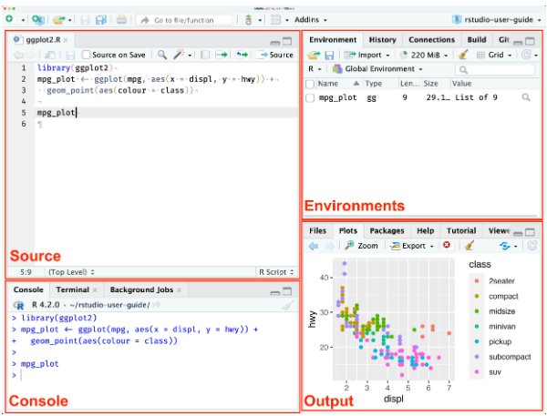

# Introducción al manejo de R

## Primeros pasos

- La instalación del lenguaje **R** puede realizarse desde la **Red Integral de Archivos de R (CRAN)**. En esta interface se debe seleccionar el sistema operativo que corresponda, por ejemplo **WINDOWS**. En la siguiente interface, seleccionar **base** (o bien **"install R for the first time"**) y, finalmente, en la siguiente pantalla, seleccionar Download R-4.4.2 for Windows (o la versión que se desee). Se descargará un archivo ejecutable con el instalador del lenguaje, el cual deberemos correr aceptando todas las instancias.

&nbsp;

::: {style="border-radius: 20px; overflow: auto; width: 100%; margin: 0 auto; justify-content: center"}

```{r echo=FALSE, warning=FALSE,message=FALSE, fig.align='center',out.width="100%"}

knitr::include_url("https://cran.r-project.org/")

```

:::

&nbsp;

- **RStudio** es un *entorno de desarrollo integrado* (**IDE**, por sus siglas en inglés) para el lenguaje de programación R, que ofrece una interfaz gráfica de usuario (GUI) amigable y diversas herramientas para facilitar el desarrollo, depuración y visualización de código. Entre sus características se incluyen la edición de código con resaltado de sintaxis, la ejecución de código línea por línea o por bloques, la gestión de paquetes, la creación de gráficos y la integración con otros programas y herramientas para el análisis de datos.

&nbsp;

::: {style="border-radius: 20px; overflow: auto; width: 60%; margin: 0 auto; justify-content: center"}

```{r echo=FALSE,out.width="100%",fig.align='center'}




```

:::

- **RStudioCloud**: Actualmente administrada por la compañía *Posit*, permite trabajar con Rstudio en la nube. Es necesario crear un cuenta ("Sign up") cuando se accede por primera vez, o bien ingresar los datos de acceso ("log in") en caso de que ya se posea una cuenta. La versión gratuita permite actualmente trabajar hasta con 50 proyectos y 25 horas de trabajo mensuales.


***Enlaces***

-   [CRAN("click")](https://cran.r-project.org/). Descarga del ***lenguaje*** R.

-   [Rstudio("click")](https://www.rstudio.com/products/rstudio/download/). Descarga del ***IDE*** RStudio.

-   [Rstudio Cloud("click")](https://posit.cloud/plans/free).

::: {.callout-note }
#### Compatibilidad

R 4.1 es la última versión compatible con versiones de 32 bits. Windows Vista ya no es compatible.

R 4.2.0 y versiones posteriores requieren Universal C Runtime (UCRT), que se incluye en Windows 10 y Windows Server 2016 o posterior. En versiones anteriores de Windows, UCRT debe instalarse antes de instalar R. UCRT está disponible para Windows desde Windows Vista SP2 y Windows Server 2008 SP2.
:::

::: {.callout-tip }
#### Importante

Antes de instalar *RStudio*, tienes que haber instalado R.
:::


### Otros IDE

- [Navure ("click")](https://www.navure.com/inicio/)

- [InfoStat ("click")](https://www.infostat.com.ar/)

-   [Jupyter ("click")](https://jupyter.org/)

-   [JASP ("click")](https://jasp-stats.org/download/)

-   [JAMOVI ("click")](https://www.jamovi.org/download.html)

-   [StatET ("click")](https://projects.eclipse.org/projects/science.statet)

-   [ESS ("click")](https://ess.r-project.org/)

-   [R Analytic flow ("click")](http://r.analyticflow.com/en/)

-   [Rattle ("click")](https://rattle.togaware.com/)

::: {.callout-tip }
#### Tip

**¡¡¡ R PUEDE SER EJECUTADO SIN NECESIDAD DE UN IDE!!!**

Por ejemplo, en la barra de búsqueda de *Windows*, seleccionar **Editar las variables de entorno de esta cuenta**. Aparecerá la ventana **Variables de entorno**. En el bloque **Variables de usuario para usuario**, seleccionar **Path** y luego presionar **Editar...**. Aparecerá la ventana **Editar las variables de entorno**. Presionar la opción **Nuevo** e ingresar **C:\\Program Files\\R\\R-4.4.2\\bin** (o la versión que se desee). Finalmente, *Aceptar*.

Desde ahora podremos correr código R desde la ventana de comandos **Símbolo del sistema**, a la cual se accede ingresando el comando **CMD** en la barra de búsqueda de *Windows*. Basta ejecutar el comando **r** para comenzar a correr código de R, y **q()** para salir.
:::

## Objetos

<font style="color:darkcyan;">"Todo en R es un objeto"</font>

Se conoce como <font style="color:darkcyan;">objeto</font> a toda entidad creada y manipulada en **R**. Datos, tablas, gráficos, funciones, vectores, matrices, son algunos tipos de objetos en R. 

Los objetos en R se caracterizan porque pueden presentar distintos <font style="color:darkcyan;">atributos</font>, por ejemplo, un <font style="color:darkcyan;">nombre</font>. Esto quiere decir que al momento de <font style="color:darkcyan;">almacenar</font> un objeto es posible asignarle un nombre.

::: callout-note
####### **Nota**

Al momento de nombrar un objeto en **R**, es importante utilizar nombres claros y cortos que permitan manipular con sencillez el objeto. También se sugiere utilizar nombres que permitan recordar fácilmente el contenido de los objetos.

Los nombres pueden incluir letras, números (siempre y cuando estén precedidos por una letra), guión bajo y puntos (antes o después de las letras). No se pueden utilizar símbolos especiales ("\*", ":", "-", "\~","\$", entre otros) ni palabras reservadas (NA, for, while, TRUE, FALSE, Inf, NaN, NULL) en la denominación de un objeto.

**R** distingue mayúsculas y minúsculas, por lo que las variables *a* y *A* serán consideradas como objetos diferentes.

:::

Podemos almacenar los datos en variables por medio del operador "=" o bien por medio de los operadores de asignación "\<-" o "-\>". También podemos asignar valores utilizando la función **assign()**.

La función **class()** nos devuelve el atributo *tipo de dato*.


```{r eval = FALSE, collapse=TRUE}
a = 1
a
class(a)

a <- 1
a
class(a)

1 -> a
a
class(a)

assign("a", 1)
a
class(a)

```


::: {.callout-note }
#### Nota

Notar que las asignaciones se realizaron de derecha a izquierda en los dos primeros casos, y de izquierda a derecha en el tercero. La práctica más extendida es realizar la asignación de derecha a izquierda.

:::

*Ejemplos de atributos*

-   Class

-   Dim: dimensión (matrices, dataframes, arreglos)

-   Names: nombre de los componentes de un objeto

-   Length: longitud de un vector.

-   Ncol, Nrow: número de columnas/filas (en matrices, dataframes, etc.)

-   Frecuency: frecuencia en una serie de tiempo

-   Etc.

::: {.callout-note }
#### Tipos de datos

En R, los tipos de datos principales se pueden agrupar en **tipos atómicos**, que son las unidades mínimas de información, y las **estructuras de datos**. Los principales tipos de datos atómicos son:

- <font style="color:darkcyan;">numeric</font>: son datos numéricos. Un caso especial de datos numéricos es el tipo <font style="color:darkcyan;">integer</font> (entero).

- <font style="color:darkcyan;">character</font>: son datos de tipo texto

- <font style="color:darkcyan;">logical</font>: son datos lógicos, que pueden adoptar uno de dos valores: TRUE o FALSE.

- <font style="color:darkcyan;">complex</font>: Números complejos, por ejemplo a = 2 + 3i.

También puede mencionarse el tipo de dato <font style="color:darkcyan;">raw</font>, usado para almacenar secuencias de bytes útiles para trabajar con datos binarios, pero su empleo se realiza en contextos muy específicos, por lo que usualmente no trabajaremos con ellos.

Además, según la estructura de los datos, los objetos pueden ser:

- <font style="color:darkcyan;">Vectores</font>: son series de objetos del mismo tipo atómico.

- <font style="color:darkcyan;">Matrices</font>: son arreglos en filas y columnas de objetos del mismo tipo atómico.

- <font style="color:darkcyan;">Arreglos ("arrays")</font>: extienden las matrices a más dimensiones.

- <font style="color:darkcyan;">Tablas</font>(data.frames o tibbles): son arreglos en filas y columnas de objetos que pueden pertenecer a diferentes tipos atómicos.

- <font style="color:darkcyan;">Listas</font>: son series de objetos que pueden presentar diferentes estructuras.

- <font style="color:darkcyan;">Factores</font>: son series de objetos indexados o que presentan un ordenamiento jerárquico. Para indicar el índice de un objeto, se emplea [[]] en lugar de [].

:::

#### Ejemplos de clases de datos

```{r eval = FALSE, collapse=TRUE}

x = 5
class(x)
mode(x)

x = 5L
class(x)

z = seq(0, 10, 2) # Secuencia: 'desde', 'hasta', 'cada'
class(z)

z = as.integer(z)
class(z)

sexo = c("masculino", "femenino")
class(sexo)

notas = c("1", "2", "3", "4", "5", "6", "7", "8", "9", "10")
class(notas)
mean(notas)
notas = as.numeric(notas)
class(notas)
mean(notas)

condicion = (z > x)
condicion
class(condicion)

complejo = 2 + 3i
complejo
class(complejo)

calificacion = factor(levels = c("insuficiente","regular","sobresaliente"))
calificacion
class(calificacion)

factor.sexo = as.factor(sexo)
factor.sexo
class(factor.sexo)

matrizNotas = matrix(notas, nrow = 5, ncol = 2)
matrizNotas
class(matrizNotas)

serie = seq(12)
serie
miArreglo = array(serie, dim = c(2,2,2)) # Las dimensiones hacen referencia al número de filas, número de columnas y número de capas, en ese orden
miArreglo

miLista = list(sexo, notas, calificacion)
miLista

miLista1 = miLista[[1]]
miLista1
class(miLista1)

tabla = data.frame(
  Alumno = c("Juan", "Ana", "María"), # Columna 1
  Notas = c(5, 8, 10) # Columna 2
)
tabla

```

:::callout-tip
##### Comentarios (#)

En **R**, toda línea precedida por el símbolo <font style="color:darkcyan;">#</font> (numeral) no es ejecutada. Su empleo es muy útil para realizar comentarios o descripciones dentro del código.

:::


<font style="color:darkcyan;">Los tipos de estructuras más utilizados en el análisis de datos estadísticos son los vectores, matrices, tablas y factores.</font>

Podemos ver que es posible modificar la tipología de un dato por otra, de ser necesario. Algunas funciones utilizadas son:

- as.numeric(); as.integer()

- as.character()

- as.factor()

- as.logical()

- as.data.frame()

- as.array()


#### Borrado de objetos

Para borrar objetos almacenados, se utiliza la función **rm()**.

```{r eval = FALSE, eval=FALSE, collapse=TRUE, eval=FALSE}

# Borrado de un objeto

rm(a)
a
# Error: objeto 'a' no encontrado

# Borrado de todos los objetos en el entorno

rm(list = ls())

```

:::callout-tip

##### Tip

**Antes de comenzar cualquier análisis estadístico, se sugiere borrar todos los objetos que pudieran estar almacenados en el entorno.**

:::

---

## Funciones

<font style="color:darkcyan;">Todo lo que ocurre en R es el resultado de una función</font>

Una función en **R** es un bloque de código que realiza una tarea específica. Se la invoca por medio de un <font style="color:darkcyan;">nombre</font> seguido de <font style="color:darkcyan;">paréntesis</font> que pueden contener <font style="color:darkcyan;">argumentos</font> si son necesarios. Por ejemplo:


```{r eval = FALSE, collapse=TRUE, warning=FALSE,message=FALSE}

a = 30

b = 20

sort(c(a, b))

sum(a, b) # equivalente a 'a + b'

```


R tiene muchas funciones integradas para realizar diversas operaciones, como cálculos matemáticos, manipulación de datos, gráficos, etc. Ejemplos incluyen **sum()**, **mean()**, **length()**, **plot()**, **sort()**, entre otros. Aún así, es posible crear funciones propias, lo cual se trabajará más adelante en la cursada.

---

### Paquetes

En R, todas las funciones y sets de datos están almacenados en *paquetes*. Sólo cuando se *cargue* un paquete su contenido estará disponible. Ésto se realiza por una cuestión de eficiencia en el uso de los recursos computacionales, y también por seguridad.

Algunos paquetes o *librerías* forman parte del código fuente de R, y son conocidos como librerías de *base*, disponibles con la instalación de R. El resto de las librerías deben ser instaladas desde el *CRAN*, mediante el comando *install.packages("nombre del paquete")*. En este último caso, para poder utilizar las funciones de estas librerías, se debe correr el comando *library("nombre del paquete")*.

::: {.callout-note }
#### Nota

También es posible instalar paquetes desde un archivo previamente descargado desde el CRAN. Para ello se puede correr el comando:

**install.packages(file.choose(), repos = NULL, type="source")**
:::

Por ejemplo, para importar archivos de datos con distintas extensiones, se puede utilizar la función **import()** de la librería *{rio}*.


```{r eval = FALSE, collapse=TRUE,eval=FALSE}
install.packages("rio") # instalación de la librería (solo una vez)
library("rio") # invocación de la librería (cada vez que deseemos utilizar alguna de sus funciones)
import(file.choose()) # función import para leer archivos de datos y file.choose() para seleccionar archivos almacenados


```


Algunas de las librerías más utilizadas en R están "empaquetadas" en la librería *Tidyverse*.

### Concatenación de funciones: el operador "|>" (*pipe*)

Con frecuencia es necesario "anidar" funciones en **R**, por ejemplo:

```{r eval = FALSE, collapse=TRUE}

numeros = seq(20)
numeros
round(sqrt(mean(numeros)), digits = 2)

```

En la función anterior, la función **mean()** está anidada dentro de la función **sqrt()**, que a su vez está anidada dentro de la función **round()**. En estos casos, se dificulta llevar un control de las operaciones realizadas, por lo que se suele recurrir al operador <font style="color:darkcyan;">|></font> ("pipe"), que permite <font style="color:darkcyan;">concatenar</font> funciones:

```{r eval = FALSE, collapse=TRUE}

numeros = seq(20)
numeros |> mean() |> sqrt() |> round(digits = 2)

```

o bien:

```{r eval = FALSE, collapse=TRUE}

numeros |> 
  mean() |> 
  sqrt() |> 
  round(digits = 2)

```


---

## Estructuras de datos

### El vector

En R, un vector es una serie o conjunto de elementos del *mismo tipo*. Un vector puede definirse por medio del operador **c()**, y ser asignado a una variable por medio del operador = ó \<-. Por ejemplo:


```{r eval = FALSE, collapse=TRUE}
decimales = c(1,2,3.5,7.8,9); decimales; class(decimales)
enteros = c(1L, 2L, 3L, 7L, 9L); enteros; class(enteros)
# o bien
enteros = as.integer(decimales); enteros; class(enteros)
logicos = c(TRUE,FALSE,FALSE,TRUE); logicos; class(logicos)


```


::: {.callout-note }
#### Nota

Notar el empleo de ";" para concatenar diferentes comandos
:::

<font style="color:darkcyan;">En R, los vectores constituyen las estructuras de menor nivel</font>. Es decir, en R, no existen las magnitudes *escalares*, las cuales son consideradas como *vectores de tamaño 1*.

Cuando en un vector hay elementos de distinto tipo, R automáticamente "coerciona" elementos de un tipo y los asigna a otro tipo en el siguiente orden: character, numeric, integer.


```{r eval = FALSE, collapse=TRUE}

caracteres = c(1,2,"a","b",3); caracteres; class(caracteres)
sort(caracteres) #ordenamiento de caracteres

numeros = c(1.5, 2.5, 3L, 5L, 7.5); sort(numeros);class(numeros)

```


<font style="color:darkcyan;">Operaciones aritméticas,  relaciones e indexación</font>


```{r eval = FALSE, collapse=TRUE}

# Operaciones aritméticas

numeros = c(1:10)

sum(numeros)

mean(numeros)

a = 4

numeros + a

numeros - a

numeros * a

numeros / a

numeros %/% a

numeros %% a

numeros2 = c(11:20)

numeros + numeros2

b = c(3,4)

numeros + b # ojo!

a^2

a**2

# Relaciones (se aplica a condiciones)

1 < a

5 < a

b > a

b >= a

b == a

b != a

a %in% b

a %in% numeros

# Indexación

n2 = numeros[2]; n2

mean(numeros[2:10])

mean(numeros[2:length(numeros)])

mean(numeros[-1])

numeros[numeros >= 5]

mean(numeros[numeros < 8])


```


### Matrices

Una matriz es un arreglo *bidimensional* de datos *del mismo tipo*. De hecho, un vector puede ser visto como un caso especial de una matriz en la cual hay solo una fila (o solo una columna). En el caso de las matrices, es posible consultar el atributo *dim()*:


```{r eval = FALSE, collapse=TRUE}

serie = c(1:16); serie
matriz = matrix(serie,ncol = 4); matriz
matriz = matrix(serie,ncol = 4,byrow = TRUE); matriz
dim(matriz)

# indexación

matriz = matrix(serie,ncol = 4)
matriz[,2] # columna 2
matriz[2,] # fila 2
matriz[2,2] # columna 2 fila 2

# operaciones sobre filas y columnas

colSums(matriz)

colMeans(matriz)

rowSums(matriz)

rowMeans(matriz)

apply(matriz,1,sum) # suma marginal de filas

apply(matriz,2,sum) # suma marginal de columnas


```


### Uniones

Son funciones que permiten combinar objetos como vectores, matrices y tablas.

#### Unión "cbind" (unión de "columnas")


```{r eval = FALSE, collapse=TRUE}

matriz.union.col = cbind(decimales,enteros); matriz.union.col
class(matriz.union.col)
dim(matriz.union.col)

```


#### Unión "rbind" (unión de "filas")


```{r eval = FALSE, collapse=TRUE}

matriz.union.fila = rbind(decimales,enteros); matriz.union.fila
class(matriz.union.fila)
dim(matriz.union.fila)

```


### Data frames

A diferencia de una matriz, un *dataframe* puede ser visto como una colección de vectores de distinto tipo. Por ejemplo:


```{r eval = FALSE, collapse=TRUE, warning=FALSE,message=FALSE}
letras = letters[1:10]
numeros = c(1:10)
df = cbind(letras,numeros)
df
class(df)

```


Entonces:


```{r eval = FALSE, collapse=TRUE, warning=FALSE,message=FALSE}
letras = letters[1:10]
numeros = c(1:10)
df = data.frame(letras=letras,numeros=numeros)
df
class(df)

```


::: {.callout-note }
#### Nota

Una *dataframe* puede ser visto como una unión de vectores:

```{r eval = FALSE, collapse=TRUE,message=FALSE,warning=FALSE}
colNumeros = df$numeros
colNumeros
summary(colNumeros)

```

Notar el empleo del signo $\$$, indicando que el vector "numeros" *pertenece* al objeto "df".

:::

Un objeto *tibble* es un data frame mejorado:


```{r eval = FALSE, collapse=TRUE, warning=FALSE,message=FALSE}

letras = letters[1:10]
numeros = c(1:10)
df = tibble(letras=letras,numeros=numeros)
df
class(df)

```


### Otras estructuras

Como se mencionó, además de los vectores, matrices y data frames, otros tipos de estructura de datos son los arreglos o "arrays" y las listas, pero difícilmente las utilicemos en durante la cursada.


---

## Importación de datos

### Archivos .xlsx


```{r eval = FALSE, collapse=TRUE,eval=FALSE}

library(readxl)

datos = file.choose() |>
  read_excel()

View(datos)

rm(datos)

```


### Archivos .csv


```{r eval = FALSE, collapse=TRUE,eval=FALSE}

datos = read.csv(file.choose(), header = TRUE, dec = ",")

# O bien

datos = file.choose() |>
  read.csv(header = TRUE,dec = ",")

View(datos)
rm(datos)

```


### Archivos en general (librería "\{rio\}")


```{r eval = FALSE, collapse=TRUE,eval=FALSE}

library(rio)

datos = file.choose() |>
  import()

View(datos)
rm(datos)

```


### Desde el repositorio de **R**

**R** provee un extenso listado de sets de datos reales para entrenamiento, que puede consultarse por medio de la función **data()**. En caso de que se desee importar un set de datos en particular, se puede ejecutar la instrucción **data(*****nombre del set de datos*****)**, o simplemente, el nombre del set de datos. En nuestro caso:

```{r eval = FALSE, collapse=TRUE,eval=FALSE}
#| code-fold: false

datos = PlantGrowth

```

Para consultar mayores detalles acerca del set de datos, se puede ejecutar:

```{r eval = FALSE, collapse=TRUE,eval=FALSE}
#| code-fold: false

?PlantGrowth

```


---

## Exploración de datos


```{r eval = FALSE, collapse=TRUE,warning=FALSE,message=FALSE, eval=FALSE}

str(datos) # estructura
head(datos,10) # primeros 10 registros
tail(datos,10) # últimos 10 registros
summary(datos) # resumen

```


---

## Exportación de datos

Veremos únicamente cómo exportar un archivo en formato excel con el paquete \{rio\}:


```{r eval = FALSE, collapse=TRUE,warning=FALSE,message=FALSE,eval=FALSE}

install.packages("rio")

library(rio)

ruta = choose.dir() # selección destino (carpeta)

nombreArchivo = "crecimientoPlantas.xlsx"

pg |> # Exportación en formato .xlsx
  export(
    file = file.path(ruta, nombreArchivo)
  )

```


## Funciones (Profundización, lectura optativa)

Como se estableció anteriormente, en **R**, las funciones son bloques de código reutilizables que realizan una tarea específica. Toman unos valores de entrada o `argumentos`, ejecutan una serie de operaciones y devuelven un resultado. Las funciones permiten organizar el código, evitar la repetición y facilitar el mantenimiento.

### Estructura general de una función

```{r echo=TRUE, eval=FALSE}

nombre_funcion = function(argumento1, argumento2, ...) {
  # Cuerpo de la función
  # Operaciones con los argumentos
  return(resultado)  # Devuelve un valor (opcional)
}

```


**Componentes de una función:**

- `Nombre de la función`: Identificador que se usa para llamar a la función.

- `Argumentos`: Valores de entrada que la función necesita para operar. Pueden ser opcionales o tener valores por defecto.

- `Cuerpo de la función`: Contiene las operaciones que se ejecutan cuando se llama a la función.

- `Valor de retorno`: El resultado que devuelve la función (usualmente usando la función *return()*). Si no se especifica, la función devuelve el valor de la última expresión evaluada.

**Ventajas de utilizar funciones (Wickham, 2024)**

- Se puede dar a la función un nombre evocador que hará el código más fácil de entender.

- A medida que cambien los requerimientos, solo se necesitará cambiar el código en un solo lugar, en vez de en varios lugares.

- Se eliminan las probabilidades de errores accidentales al copiar y pegar (por ej., al actualizar el nombre de una variable en un lugar, pero no en otro).

**Ejemplo de una función básica**

```{r echo=TRUE, eval=FALSE}

multiplicar = function(a, b = 2) {
  return(a * b)
}
multiplicar(5)  # Usa b = 2 por defecto

multiplicar(5, 3)

```


**Funciones anónimas**

Son funciones sin nombre que se definen y usan directamente.


```{r echo=TRUE, eval=FALSE}

(function(x) x^2)(3)  # ¿Qué valor devuelve?

```

**Funciones como objetos**

Las funciones pueden asignarse a variables, pasarse como argumentos a otras funciones o devolverse como resultados.

```{r echo=TRUE, eval=FALSE}

operacion = multiplicar
operacion(2, 3)  

```


:::callout-note
## Nota

Las variables definidas dentro de una función son locales y no afectan el entorno global.

:::

### Estructuras de control

#### Estructuras de control en R: `if` y `for`

En R, las estructuras de control permiten manejar el flujo de ejecución del código. Dos de las más comunes son las estructuras condicionales (`if`) y los bucles (`for`). A continuación, se describe su uso y se proporcionan ejemplos básicos.

##### Estructura condicional `if`

La estructura `if` se utiliza para ejecutar un bloque de código si se cumple alguna condición específica. Su sintaxis básica es:

```{r echo=TRUE, eval=FALSE}
if (condición) {
  # Bloque de código que se ejecuta si la condición es verdadera
}
```

Si la condición es verdadera (`TRUE`), se ejecuta el bloque de código dentro del `if`. En caso contrario, no se ejecuta.

**Ejemplo:**

```{r echo=TRUE, eval=FALSE}
x = 10

if (x > 5) {
  print("x es mayor que 5")
}

```

También es posible agregar una cláusula `else` para manejar el caso en que la condición no se cumpla:

```{r echo=TRUE, eval=FALSE}
if (x > 15) {
  print("x es mayor que 15")
} else {
  print("x no es mayor que 15")
}
```


##### Bucles `for`

El bucle `for` se utiliza para repetir un bloque de código un número específico de veces, iterando sobre una secuencia de valores. Su sintaxis básica es:

```{r echo=TRUE, eval=FALSE}

for (variable in secuencia) {
  # Bloque de código que se ejecuta en cada iteración
}
```

En cada iteración, la variable toma un valor de la secuencia, y el bloque de código se ejecuta con ese valor.

**Ejemplo:**

```{r echo=TRUE, eval=FALSE}

for (i in 1:5) {
  print(paste("Iteración:", i))
}

```

También es posible iterar sobre vectores o listas:

```{r echo=TRUE, eval=FALSE}
frutas = c("manzana", "banana", "naranja")

for (fruta in frutas) {
  print(fruta)
}
```


##### Combinación de `if` y `for`

Las estructuras `if` y `for` pueden combinarse para crear lógicas más complejas. Por ejemplo, se puede usar un `if` dentro de un bucle `for` para realizar acciones condicionales en cada iteración.

**Ejemplo:**

```{r}

numeros = c(1, 3, 5, 7, 10)

for (num in numeros) {
  if (num %% 2 == 0) {
    print(paste(num, "es par"))
  } else {
    print(paste(num, "es impar"))
  }
}
```


## Micro-ejercicios de aplicación (optativos)

Los siguientes micro-ejercicios que te permitirán practicar los conceptos revisados en esta unidad (objetos, vectores, matrices, data frames, importación de datos, funciones y estructuras de control).
Puedes copiar y pegar las preguntas en un script de R local, o bien utilizar `webR`, que es la versión *online* de R, disponible en esta guía.


```{r eval = FALSE, collapse=TRUE}

# =============================================================================
# MICRO-EJERCICIOS DE APLICACIÓN — Introducción a R
# Ejemplos biológicos y ambientales del NOA
# =============================================================================

# -----------------------------------------------------------------------------
# I. OBJETOS, ASIGNACIÓN Y CLASES
# -----------------------------------------------------------------------------

# 1) Asigne a un objeto llamado 'altitud_pozuelos' el valor 3650 (m s.n.m.,
#    altitud aproximada de la Laguna de Pozuelos) usando el operador "<-".


# 2) Consulte la clase del objeto 'altitud_pozuelos' con class().


# 3) Asigne el nombre de la especie "Vultur gryphus" (cóndor andino) al objeto
#    'especie_condor' usando el operador "=". Verifique su clase.


# 4) Cree el objeto 'vicuna_avistada' con el valor lógico TRUE, indicando que
#    se registró presencia de vicuña (Vicugna vicugna) en un transecto de la Puna.
#    Verifique su clase.


# 5) Asigne el valor 4 (número de parches de bofedal muestreados) al objeto
#    'n_bofedales' utilizando la función assign().


# 6) Cree el objeto 'temp_media_puna' = 8.5 (°C) usando el operador "->".


# 7) Convierta el objeto 'n_bofedales' a tipo entero con as.integer() y
#    verifique su clase con class().


# 8) Borre el objeto 'temp_media_puna' del entorno con rm() y confirme el
#    error al intentar invocarlo nuevamente.


# -----------------------------------------------------------------------------
# II. VECTORES: CREACIÓN, OPERACIONES ARITMÉTICAS Y RELACIONES
# -----------------------------------------------------------------------------

# 9) Cree un vector 'peso_zorro' con las masas corporales (kg) de 5 ejemplares
#    de zorro colorado (Lycalopex culpaeus) capturados en la Quebrada de
#    Humahuaca: 4.8, 5.2, 4.5, 5.6, 4.9.


# 10) Calcule la media y el desvío estándar de 'peso_zorro'.


# 11) Cree el vector 'temp_max_yungas' con las temperaturas máximas diarias (°C)
#     registradas en el Parque Nacional Calilegua durante una semana:
#     28, 30, 27, 31, 29, 26, 30.


# 12) Calcule cuántos días la temperatura máxima superó los 29°C, usando una
#     operación de relación sobre 'temp_max_yungas'.


# 13) Cree el vector 'cobertura_cardon' con porcentajes de cobertura de cardón
#     (Echinopsis atacamensis) en 6 parcelas de la Quebrada: 12, 8, 15, 20, 10, 18.


# 14) Sume 5 puntos porcentuales a cada valor de 'cobertura_cardon' (simulando
#     un año de crecimiento) y guarde el resultado en 'cobertura_cardon_2027'.


# 15) Cree el vector 'ph_suelo_chaco' con valores de pH de suelo en 5 sitios del
#     Chaco jujeño: 6.8, 7.1, 6.5, 7.4, 6.9. Determine cuántos sitios son
#     alcalinos (pH > 7).


# 16) Cree el vector 'altura_algarrobo' con la altura (m) de 8 ejemplares de
#     algarrobo negro (Prosopis nigra): 6.2, 7.5, 5.8, 8.1, 6.9, 7.0, 5.5, 8.4.
#     Calcule el rango (máximo - mínimo) sin usar la función range().


# 17) Cree dos vectores, 'machos' y 'hembras', con el número de vicuñas
#     contadas por punto de muestreo (5 puntos cada uno):
#     machos = c(3,5,2,4,6); hembras = c(4,6,3,5,7).
#     Calcule el vector 'total_grupo' sumando ambos vectores elemento a elemento.


# 18) A partir de 'total_grupo', determine en qué puntos de muestreo el grupo
#     total superó los 9 individuos (operación de relación).


# 19) Cree el vector 'especies_yungas' con los nombres: "Tremarctos ornatus",
#     "Puma concolor", "Tapirus terrestris". Verifique su clase y longitud.


# 20) Convierta 'especies_yungas' a tipo factor con factor() y aplique
#     summary() para contar cuántos registros hay por especie.


# -----------------------------------------------------------------------------
# III. INDEXACIÓN DE VECTORES
# -----------------------------------------------------------------------------

# 21) A partir de 'peso_zorro' (ejercicio 9), extraiga el peso del tercer
#     individuo capturado.


# 22) A partir de 'temp_max_yungas' (ejercicio 11), extraiga las temperaturas
#     registradas entre el segundo y el quinto día.


# 23) A partir de 'cobertura_cardon' (ejercicio 13), excluya el primer valor y
#     calcule la media de los restantes.


# 24) A partir de 'altura_algarrobo' (ejercicio 16), extraiga únicamente los
#     valores mayores o iguales a 7 metros.


# 25) A partir de 'ph_suelo_chaco' (ejercicio 15), calcule la media de los
#     sitios con pH menor a 7.


# 26) A partir de 'total_grupo' (ejercicio 17), extraiga el valor máximo
#     registrado utilizando indexación combinada con la función which.max().

# -----------------------------------------------------------------------------
# IV. MATRICES
# -----------------------------------------------------------------------------

# 27) Un investigador registró la abundancia de cuatro especies de aves
#     acuáticas (filas) en tres lagunas altoandinas (columnas): 
#     12,8,15, 5,10,7, 20,18,22, 3,6,4 (por filas). 
#     Cree la matriz 'abundancia_aves' de 4 filas y 3 columnas (byrow = TRUE).


# 28) Consulte las dimensiones de 'abundancia_aves' con dim().


# 29) Extraiga la columna correspondiente a la segunda laguna muestreada.


# 30) Calcule la abundancia total registrada por laguna (suma por columnas).


# 31) Calcule la abundancia promedio por especie (promedio por filas).


# 32) Determine, mediante apply(), la laguna con mayor abundancia total de
#     aves acuáticas.

# -----------------------------------------------------------------------------
# V. UNIONES (cbind / rbind)
# -----------------------------------------------------------------------------

# 33) Cree dos vectores: 'sitio' = c("Yungas","Puna","Chaco") y
#     'riqueza_sp' = c(45, 18, 27) (riqueza de especies de aves por
#     ecorregión). Únalos por columnas con cbind() en el objeto 'union_col'.


# 34) Verifique la clase y dimensión de 'union_col'.


# 35) Una los mismos vectores por filas con rbind() y compare la estructura
#     resultante con la del ejercicio 33.

# -----------------------------------------------------------------------------
# VI. DATA FRAMES
# -----------------------------------------------------------------------------

# 36) Cree un data frame 'aves_NOA' con las columnas 'ecorregion' =
#     c("Yungas","Puna","Chaco") y 'riqueza' = c(45, 18, 27).


# 37) Verifique la clase de 'aves_NOA' y su estructura con str().


# 38) Extraiga la columna 'riqueza' utilizando el operador "$" y calcule su
#     media.


# 39) Agregue al data frame 'aves_NOA' una nueva columna 'superficie_km2' =
#     c(2500, 8600, 4100), correspondiente a la superficie aproximada
#     relevada en cada ecorregión.


# 40) Calcule la densidad de riqueza (riqueza / superficie_km2) para cada
#     ecorregión y almacénela en una nueva columna 'densidad_riqueza'.


# 41) Utilizando indexación de data frame ([fila, columna]), extraiga el
#     valor de riqueza correspondiente a la Puna.


# 42) Aplique summary() sobre el data frame 'aves_NOA' completo e identifique
#     qué ecorregión presenta mayor riqueza de aves.

# -----------------------------------------------------------------------------
# VII. IMPORTACIÓN Y EXPORTACIÓN DE DATOS ({rio})
# -----------------------------------------------------------------------------

# 43) Exporte el data frame 'aves_NOA' a un archivo "aves_NOA.xlsx" utilizando
#     la función export() de la librería {rio}.


# 44) Importe nuevamente el archivo "aves_NOA.xlsx" y asígnelo al objeto
#     'aves_importado'.


# 45) Verifique con class() e str() que la estructura de 'aves_importado'
#     coincide con la del objeto original 'aves_NOA'.


# 46) Exporte únicamente la columna 'riqueza' de 'aves_NOA' a un archivo CSV
#     llamado "riqueza_aves.csv".

# -----------------------------------------------------------------------------
# VIII. FUNCIONES PROPIAS Y ESTRUCTURAS DE CONTROL
# -----------------------------------------------------------------------------

# 47) Escriba una función 'convertir_mm_cm' que reciba un valor en milímetros
#     y devuelva su equivalente en centímetros. Aplíquela al vector 'svl'
#     (longitud hocico-cloaca) del Ejemplo 1 del script de clase.


# 48) Escriba una función 'clasificar_cobertura' que reciba un valor de
#     cobertura vegetal (%) y devuelva "Degradado" si es menor a 30, o
#     "Conservado" en caso contrario, utilizando una estructura if/else.


# 49) Utilizando un bucle for, recorra el vector 'cobertura_cardon' (ejercicio
#     13) e imprima, para cada parcela, si su cobertura es "Baja" (<15) o
#     "Alta" (>=15), combinando for e if.


# 50) Utilizando un bucle for sobre el vector 'peso_zorro' (ejercicio 9),
#     imprima un mensaje indicando el número de individuo y su peso en
#     gramos (convirtiendo de kg a g dentro del bucle).

```


